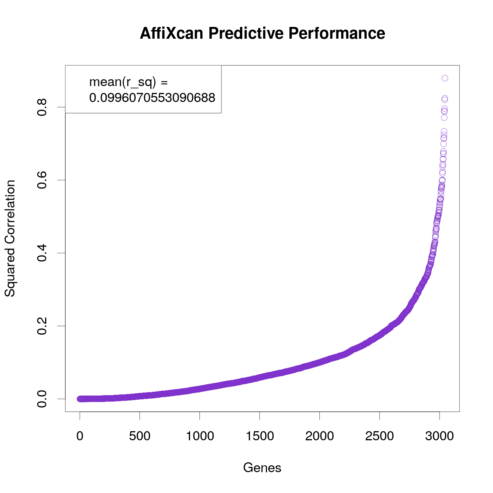
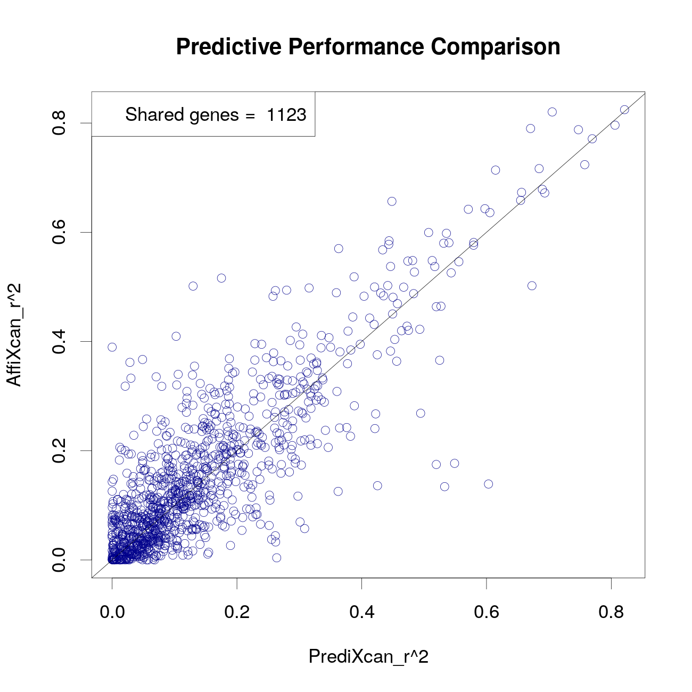
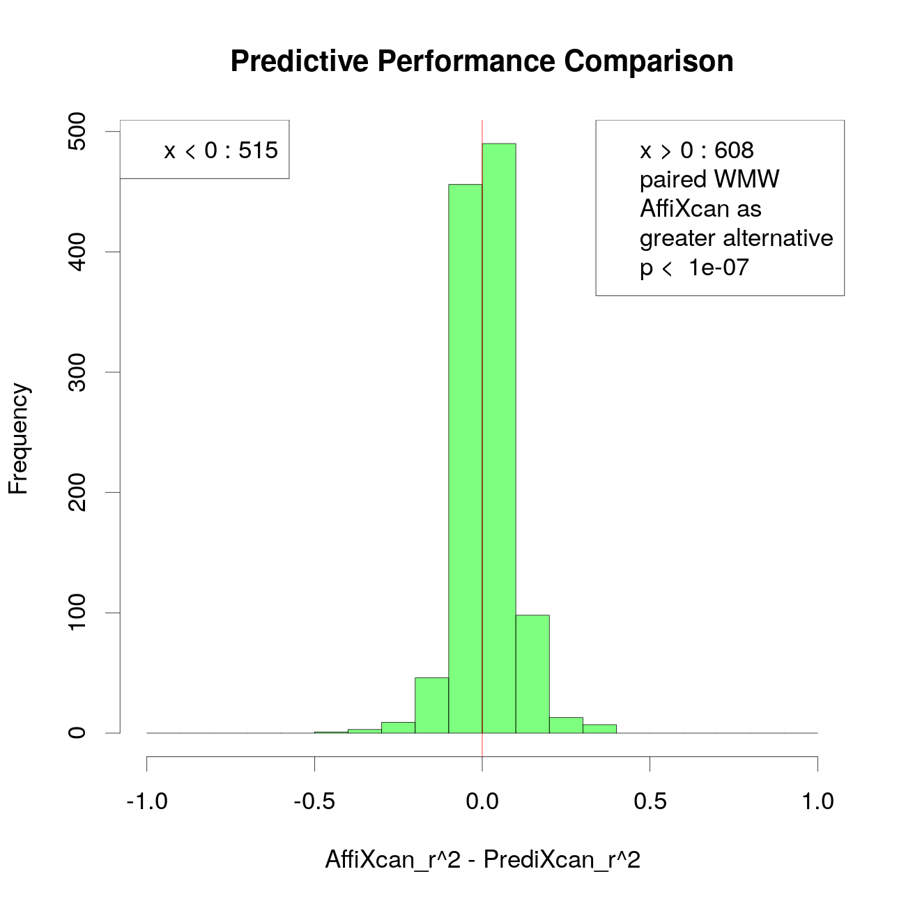

This package includes a set of functions to train and to apply statistical models to estimate GReX (genetically regulated expression). 

## GReX

### What is GReX?
GReX is the component of gene expression (here defined as the transcript level, e.g RPKM) explained by an individual's genetics.

The abundance of a transcript in a cell is determined by many factors, including genetics, environmental factors, and disease. It can have an impact on the cell's physiology and alter the expression of other transcripts or proteins, their activity and regulation. Since transcription is initiated by the binding of transcription factors to DNA, a portion of gene expression can be directly explained by variants in cis regulatory regions.

### Why GReX?
The estimation of GReX can be useful to perform TWAS when the real total expression profile is unknown or can not be measured, for example in those tissues - like the brain - that are inaccessible to _in vivo_ safe biopsies, or in ancient genomes. 

GReX can be also exploited to estimate the constitutive susceptibility of a genome to a certain status, whose existence is at least partially influenced by gene expression.

### Estimate GReX
Some efforts have been made to develop computational methods to predict GReX from genotype data using mathematical models. 

[Gamazon et al.](http://www.nature.com/articles/ng.3367) developed a method consisting of multiple-SNP prediction of expression levels, where the estimated GReX for a gene is given by an additive model in which SNPs are the independent variables.

AffiXcan takes into account the contribution of all polymorphisms of given genomic regions that are associated to the expression of a gene. This is done using affinity scores between those regions and a set of transcription factors. A principal component analysis (PCA) is performed on these scores and for each expressed gene a linear model is fitted.

We observed that the GReX of the majority of genes for which AffiXcan manages to generate a significant model is not predictable by the method cited above. Arguably, this is due to the nature of TBA, that allows to take into account the additive small effect of all variants in a genomic region. Furthermore, the goodness of prediction achieved by AffiXcan on both shared and non-shared genes was significantly greater. For brief insights on AffiXcan's results in preliminary tests, see [AffiXcan performance](#affixcan-performance) section.

## AffiXcan workflow
AffiXcan estimation of GReX is based on a functional approach that involves a score to quantify the affinity between a PWM (position weight matrix) and a DNA segment: the TBA (Total Binding Affinity). TBA can be computed using [vcf_rider](http://github.com/vodkatad/vcf_rider) program, starting from vcf files.

### Training the models
Here are described the input files needed by AffiXcan to perform the training phase. The function __affiXcanTrain()__ returns an object that can be later used by __affiXcanImpute()__ to estimate GReX. See help("affiXcanTrain") for usage.

#### TBA matrices
As a first step, AffiXcan performs a principal component analysis (PCA) on the TBA values for each regulatory region. The user has to provide the paths to __rds__ files that contain TBA matrices, in the form of [MultiAssayExperiment](https://bioconductor.org/packages/release/bioc/html/MultiAssayExperiment.html) objects. A toy example of one of this objects is shown below:

```{r}
library(MultiAssayExperiment)
tba <- readRDS(system.file("extdata","training.tba.toydata.rds", package="AffiXcan")) ## This is a MultiAssayExperiment object
tba <- updateObject(tba)
names(assays(tba))
```

__assays(tba)__ returns a list of 9 matrices, each of which contains the log<sub>2</sub>(TBA) values for a different regulatory region. The matrices must be named with unambiguous identifiers of the regulatory regions. For illustrative purposes a small portion of the TBA matrix of the region named "ENSG00000139269.2" is displayed below. Rows are individual's IDs and columns are PWMs:

```{r}
assays(tba)$ENSG00000139269.2[1:5,1:4]
```

Centering and scaling (optional) of TBA values is done before computing principal components. The user has to specify the minimum percentage of variance to be explained by the principal components selected by AffiXcan to train the model's coefficients, in order to achieve a good compromise between sensibility and overfitting.

#### Expression matrix
AffiXcan needs real expression values to train the models. The user has to specify an R object of class [SummarizedExperiment](https://bioconductor.org/packages/release/bioc/html/SummarizedExperiment.html) and the name of the __assay()__ (here, "values") that contains the expression matrix. A toy example of such an object is shown below. In the expression matrix, rows are expressed genes and columns are individual's IDs:

```{r}
suppressMessages(library(SummarizedExperiment))
load("../data/exprMatrix.RData")
assays(exprMatrix)$values[,1:5]
```

#### Gene - Region(s) associations
The user has to provide a table with the association between expressed genes and regulatory regions. Every expressed gene must be associated to at least one regulatory region. To fit the model for one gene, AffiXcan includes the selected principal components of all regulatory regions associated to that gene, e.g.:

GReX_geneA ~ PC1_regionA1 + PC2_regionA1 + PC3_regionA1 + PC4_regionA1 + PC1_regionA2 + PC2_regionA2 ...

The associations table's header must contain the strings "REGULATORY_REGION" and "EXPRESSED_REGION". An example is shown below:

```{r}
load("../data/regionAssoc.RData")
regionAssoc[1:3,]
```

Here it can be observed that the expressed gene "ENSG00000139269.2" is associated to three different regulatory regions. The expressed genes' names must be the same as found in the [expression matrix](#expression-matrix) and the regulatory regions' names must be consistent with those used for the [TBA matrices](#training-the-models).

#### Pupulation structure covariates
Finally, AffiXcan computes the ANOVA p-value for each model to assess if the estimation of GReX is significantly independent from the population genetic structure. The principal components of the population structure for every individual must be provided by the user to be included in the models. Here is shown an example of an R object that can be used for this purpose and that contains the first three PCs of the population structure:

```{r}
load("../data/trainingCovariates.RData")
head(trainingCovariates)
```

Benjamini-Hochberg correction for multiple testing is then performed on the models' P-values. AffiXcan will eventually compute a predicted GReX only for those genes for whom the model P-value is <0.05 after the correction.

### Imputing GReX
Here are described the input files needed by AffiXcan to perform the prediction phase. The function __affiXcanImpute()__ uses parts of the output of __affiXcanTrain()__ to compute the imputed GReX values in a population of individuals. See help("affiXcanImpute") for usage.

#### TBA matrices
TBA values for regulatory regions referring to the population for which we want to estimate GReX are needed. The user has to provide paths to __rds__ files that contain TBA matrices, in the form of [MultiAssayExperiment](https://bioconductor.org/packages/release/bioc/html/MultiAssayExperiment.html) objects. This type of data is described in the [training phase](#training-the-models) section.

To apply the models consistently, TBA must be calculated on the same regions and using the same PWM set as done for the training phase. The unambiguous regions' IDs used to name the TBA matrices stored in MultiAssayExperiment objects need to match those used in the training phase.

#### Eigenvectors
AffiXcan performs a matrix product between TBA values and eigenvectors to obtain the selected principal components that will be used as variables when estimating GReX. Eigenvectors are computed by __affiXcanTrain()__ when performing principal components analysis (PCA) on the training dataset. The user has to specify the object in which PCA results from affiXcanTrain() are stored: if the returning object from affiXcanTrain() is named "training", the object of our interest will be training$pca.

#### Coefficients
For every gene the selected principal components of the TBA are multiplied by the model's coefficients, previously trained on the training dataset by __affiXcanTrain()__. The user has to specify the object in which the regression models' results from affiXcanTrain() are stored. If the returning object from affiXcanTrain() is named "training", the object of our interest will be training$bs.

### Final Output
__affiXcanTrain()__ returns a [SummarizedExperiment](https://bioconductor.org/packages/release/bioc/html/SummarizedExperiment.html) object containing a matrix with the imputed GReX values. To access it we can use assays()$GReX as shown below. Here it is a toy example to impute the GReX of a single gene in a cohort of 115 individuals. In the GReX matrix the rows are genes and the columns are individual's IDs:

```{r}
suppressMessages(library("AffiXcan"))

trainingTbaPaths <- system.file("extdata","training.tba.toydata.rds", package="AffiXcan")
data(exprMatrix)
data(regionAssoc)
data(trainingCovariates)
assay <- "values"

training <- affiXcanTrain(exprMatrix=exprMatrix, assay=assay, tbaPaths=trainingTbaPaths, regionAssoc=regionAssoc, cov=trainingCovariates, varExplained=80, scale=TRUE, cores=1)

testingTbaPaths <- system.file("extdata","testing.tba.toydata.rds", package="AffiXcan")
exprmatrix <- affiXcanImpute(tbaPaths=testingTbaPaths, pca=training$pca, bs=training$bs, scale=TRUE, cores=1)

grexMatrix <- assays(exprmatrix)$GReX
as.data.frame(grexMatrix)[,1:5]
```

### Parallelization
AffiXcan processes can take a certain amount of time to complete, but all functions support parallelization. The user has to indicate the number of cores that can be used by AffiXcan to parallelize the tasks. [doParallel package](https://www.rdocumentation.org/packages/doParallel/versions/1.0.10) is required for parallelization.

### AffiXcan Performance
This section has the only purpose to briefly show the predictive performance obtained using AffiXcan in preliminary tests, and its comparison against the multiple-SNP prediction method described in [Gamazon et al.](http://www.nature.com/articles/ng.3367). Much further work, also regarding other datasets, is still in progress.

#### Cross-validation on GEUVADIS dataset
AffiXcan models were cross-validated on a cohort of 344 individuals of European descent for whom phased genotype data and expression data (RNA-seq of EBV-transformed lymphocites) are available in the [GEUVADIS public dataset](https://www.ebi.ac.uk/arrayexpress/files/E-GEUV-1/).

The cohort was randomly splitted in a training set of 229 individuals and a testing set of 115 individuals. The training phase was performed on the training set, then the trained models were applied on the testing set to impute GReX. 

Each gene was associated to only one regulatory region, which consisted in a genomic window spanning upstream and downstream the Transcription Start Site (TSS). The minimum percentage of variance of TBA to be explained by the selected principal components was set to 80.

#### Predictive Performance
The number of genes (~3000) for which a significant model was generated by AffiXcan was almost equal to the number of genes for which a GReX can be imputed using the method described in [Gamazon et al.](http://www.nature.com/articles/ng.3367)

The predictive performance was assessed observing the squared correlation (R<sup>2</sup>) between the imputed GReX values and the real total expression values for each gene. The overall mean of R<sup>2</sup> values obtained with AffiXcan was greater than the one obtained with the multiple-SNP method (0.099 vs 0.070)



#### Predictive Performance Comparison
Remarkably, the overlap between the genes for which an imputed GReX could be computed by the two methods is only slightly greater than one third (1123) of the amount computed by each method. Arguably, this is due to the implementation of TBA to take into account the contribution of all genetic variants in a regulatory regions, rather then only those SNPs with a greater effect size on gene expression. Supposedly, AffiXcan manages to generate a significant model to estimate GReX in genes whose expression is influenced by many variants each contributing to GReX with a small effect size, where the multiple-SNP prediction method fails to have good statistical predictors.

Observing the squared correlation (R<sup>2</sup>) between the imputed GReX values and the real total expression values on the shared genes, a Wilcoxon-Mann-Whitney paired test was performed to asses if the two distribution of R<sup>2</sup> values were significantly different. R<sup>2</sup> values from AffiXcan proved to be significantly higher:

In conclusion, AffiXcan could increase the amount of genes for which a GReX can be estimated by a factor >1.6, at the same time enhancing the goodness of prediction.
